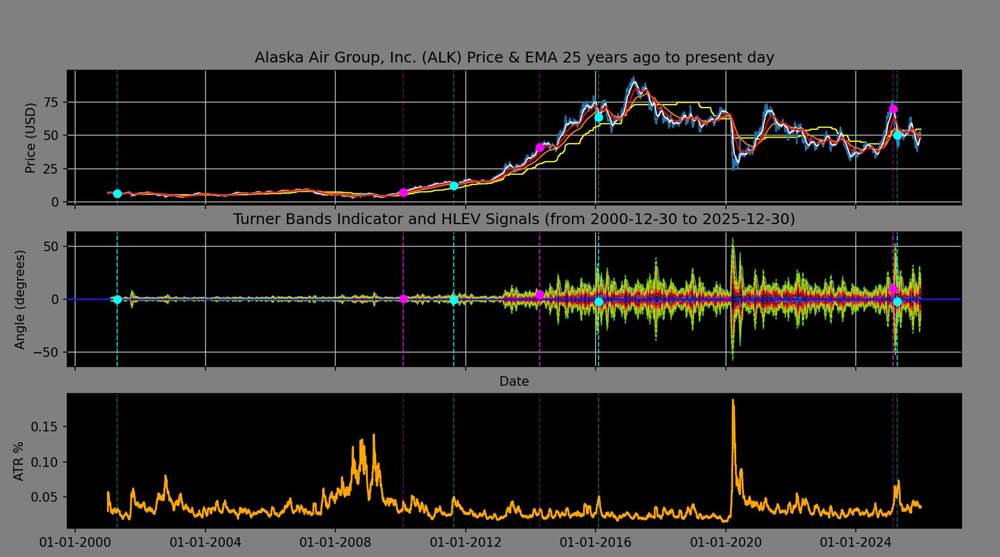
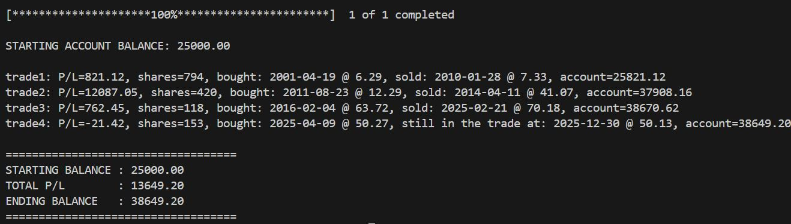
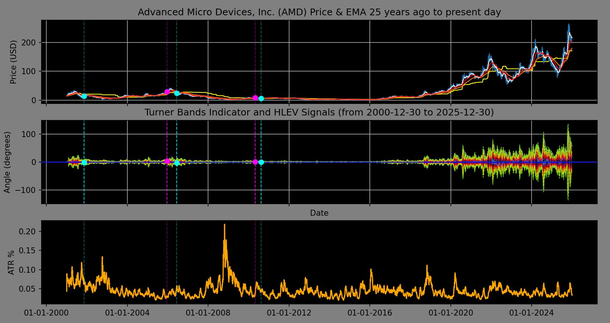
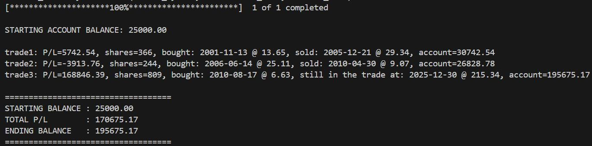

# LLLongTerm — Long-Horizon Market Data Analysis

## Overview

**LLLongTerm** is a Python-based market data analysis script designed to evaluate **long-term price behavior and trend dynamics** using approximately **25 years of daily historical market data**.

The project focuses on:
- Long-horizon indicator construction
- Volatility-normalized signal detection
- Research and visualization of trend exhaustion and reversal conditions

This tool is intended for **analysis and experimentation**, not live trading or execution.







---

## What This Project Does

- Retrieves ~25 years of **daily historical market data** using `yfinance`
- Computes long-term technical indicators, including:
  - EMA-based trend direction and slope
  - Volatility-normalized angle measurements
  - Rolling statistical bands (σ-levels)
  - Custom HLEV (High–Low Equilibrium Value) metrics
  - ATR-based volatility context
- Identifies **potential buy/sell signal regions** based on indicator crossings and stateful logic
- Simulates trade entries and exits to evaluate **signal behavior over time**
- Visualizes price action, indicators, volatility, and signals using Matplotlib

**Note:**  
Historical data is processed **in memory only**. The 25-year dataset is *not* persisted to a database.

---

## Key Concepts Used

### EMA Slope & Angle Analysis
Measures trend direction using the geometric angle of the EMA200 slope rather than raw price movement.

### Volatility Normalization (σ-bands)
Uses rolling standard deviation of EMA angle to contextualize trend strength and exhaustion.

### HLEV (High–Low Equilibrium Value)
A custom metric derived from rolling one-year high/low ranges to estimate equilibrium zones.

### Stateful Signal Filtering
Prevents overlapping or repeated buy/sell signals by enforcing sequential trade states.

### ATR-Based Risk Context
Incorporates Average True Range (ATR) to contextualize volatility and position sizing.

---

## Technology Stack

- **Python**
- **pandas / NumPy** — data manipulation and analysis
- **yfinance** — historical market data retrieval
- **Matplotlib** — visualization
- **python-dateutil** — date arithmetic

---

## Example Output

The script produces:
- Console output showing simulated trade entries, exits, and running account value
- Multi-panel plots displaying:
  - Price with EMA overlays and HLEV origin
  - EMA angle with σ-bands and signal markers
  - ATR percentage over time

### Console / Printable Output

In addition to graphical plots, the script produces **human-readable console output** summarizing each simulated trade event.

For each completed trade, the output includes:
- Trade number
- Buy and sell dates
- Entry and exit prices
- Calculated position size
- Profit or loss for the trade
- Running account balance

At the end of execution, a final summary is printed showing:
- Starting account balance
- Total profit or loss
- Ending account balance

This textual output is designed to be:
- Easy to review without visual plots
- Suitable for logging or redirection to a file
- Helpful for validating signal behavior during research and tuning


These visualizations are intended to support **research and interpretation**, not automated decision-making.

---

## How to Run
---
AUTHENTICATION NOTICE (OAuth2)
This program relies on OAuth2 authentication with Charles Schwab.
---
OAuth2 token acquisition, refresh, and storage are intentionally
handled outside of this script.

This script assumes:
A valid OAuth2 access token already exists
Token refresh is managed by external tooling or services
No credentials, secrets, or auth flows are embedded here

Any authentication failures are surfaced via API errors and
handled through recovery or manual re-authentication scripts.


You will have to place code for your strategy to get this to work. The strategy presented in the example pictures has been removed because it is proprietary.

```bash
pip install yfinance pandas numpy matplotlib python-dateutil
python LLLongTerm.py
